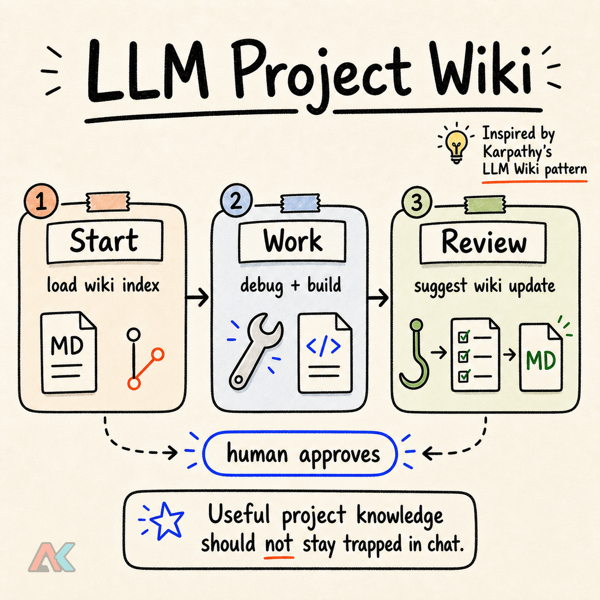

# LLM Project Wiki

<p align="center">
  
</p>

A project-local LLM Wiki workflow with Claude Code and Codex hooks, human-approved updates, and git-tracked engineering memory.

This repository is a small, copyable example of the LLM Wiki pattern: keep durable project knowledge inside the repository, let an AI coding agent propose updates, and use hooks to make the agent evaluate whether a session produced knowledge worth saving.

The point is not to create another documentation folder. The point is to make project memory part of the agent workflow.

## What This Gives You

- A `wiki/` directory for git-tracked project knowledge.
- A `SessionStart` hook that loads the wiki index into Claude Code or Codex context.
- A Claude Code `Stop` hook that nudges the agent to evaluate whether the conversation produced wiki-worthy knowledge.
- A repo-scoped `wiki-review` skill for manual review and suggestion flow.
- A human approval rule so the agent proposes wiki updates instead of silently rewriting the knowledge base.
- A small install script for copying the template into another repository.

## Repository Layout

```text
.
├── .claude/
│   ├── hooks/scripts/wiki_stop_hook.py
│   ├── hooks/scripts/wiki_session_start.py
│   ├── rules/wiki-workflow.md
│   ├── settings.json
│   └── skills/wiki-review/SKILL.md
├── .codex/
│   ├── hooks.json
│   ├── hooks/scripts/wiki_session_start.py
│   └── hooks/scripts/wiki_stop_hook.py
├── .agents/
│   └── skills/wiki-review/
│       ├── SKILL.md
│       └── agents/openai.yaml
├── scripts/
│   ├── install.sh
│   └── smoke_test.sh
├── templates/
│   └── wiki-page.md
└── wiki/
    ├── README.md
    ├── index.md
    ├── log.md
    └── system-overview.md
```

## Quick Start

Clone this repository, then copy the template into a target project:

```bash
git clone https://github.com/k79k06k02k/llm-project-wiki.git
cd llm-project-wiki
./scripts/install.sh /path/to/your/project
```

## AI Agent Install Prompt

Copy this prompt into an AI coding agent while it is working inside the target project:

```text
Please integrate LLM Project Wiki into the current project: https://github.com/k79k06k02k/llm-project-wiki.git

Run `scripts/install.sh` from that repository.
```

Then open the target project with Claude Code or Codex. On session start, the agent should receive the wiki index as additional context. Claude Code uses a blocking stop hook for substantial responses; Codex keeps the stop hook non-blocking and relies on injected instructions so the transcript is not polluted by hook feedback.

The installer is designed for existing projects:

- It does not overwrite existing wiki, rule, hook, or skill files.
- If `.claude/settings.json` already exists, it merges the LLM Wiki hooks into the existing `hooks` object and writes a timestamped backup next to the original file.
- If `.codex/hooks.json` already exists, it does the same for Codex hooks.
- If a file path already exists, the installer skips that file and prints it. Review skipped paths manually.

Requirements: `bash`, `python3`, and `git`. The target should be a git repository so repo-local hooks can resolve the project root from subdirectories.

Codex discovers repository skills from `.agents/skills`. The checked-in `.agents/skills/wiki-review/SKILL.md` is intentionally a thin shim that points to the canonical workflow in `.claude/skills/wiki-review/SKILL.md`, so the Claude Code and Codex skill instructions do not drift apart.

## How The Workflow Works

1. `wiki/index.md` is loaded at the start of an agent session.
2. The agent reads relevant wiki pages before editing related code.
3. During work, the agent may propose a `Wiki suggestion` when it discovers durable knowledge.
4. At the end of substantial work, the agent evaluates whether the session produced wiki-worthy knowledge.
5. The agent proposes a `Wiki suggestion` when there is durable knowledge to record. In Codex, do not add no-op markers solely for the hook; keep the transcript clean.
6. Human approval is required before any wiki file is created, updated, or deleted.

This keeps the system boring and auditable. Boring is good here. Unreviewed AI memory is just a more confident way to store mistakes.

## Wiki-Worthy Knowledge

Capture knowledge that saves future investigation:

- Cross-file architecture that is hard to reconstruct from code alone.
- Design decisions and the reasons behind them.
- API integration details that live between code and backend behavior.
- Bug roots and fixes other developers or QA may hit again.
- Project conventions not obvious from the style guide.

Do not record everything. Small one-file fixes usually do not need a wiki page.

## Hook Markers

The Claude Code stop hook looks for either marker in the final assistant response:

- `Wiki suggestion`
- `No wiki updates needed`

Codex does not block on missing markers. Codex renders stop-hook blocks as visible Hook feedback and can create marker-only follow-up messages, so the Codex stop hook is intentionally non-blocking.

## Smoke Test

Run:

```bash
./scripts/smoke_test.sh
```

The smoke test verifies that:

- Stop hooks allow short responses.
- Claude Code stop hook blocks substantial responses without a wiki marker.
- Codex stop hook allows substantial responses without emitting Hook feedback.
- Stop hooks allow responses containing `Wiki suggestion`.
- Stop hooks allow responses containing `No wiki updates needed`.
- The installer creates Claude Code hooks, Codex hooks, and repo-scoped Codex skill files in a fresh target.
- Installed session hooks can load wiki and git context from a project subdirectory.
- Existing Claude Code and Codex hook configs are merged instead of overwritten.

## Design Notes

This example intentionally uses plain Markdown, git, and hooks.

No vector database. No dashboard. No fake "agent memory platform." Add those only when the boring version stops being enough.

## License

MIT
